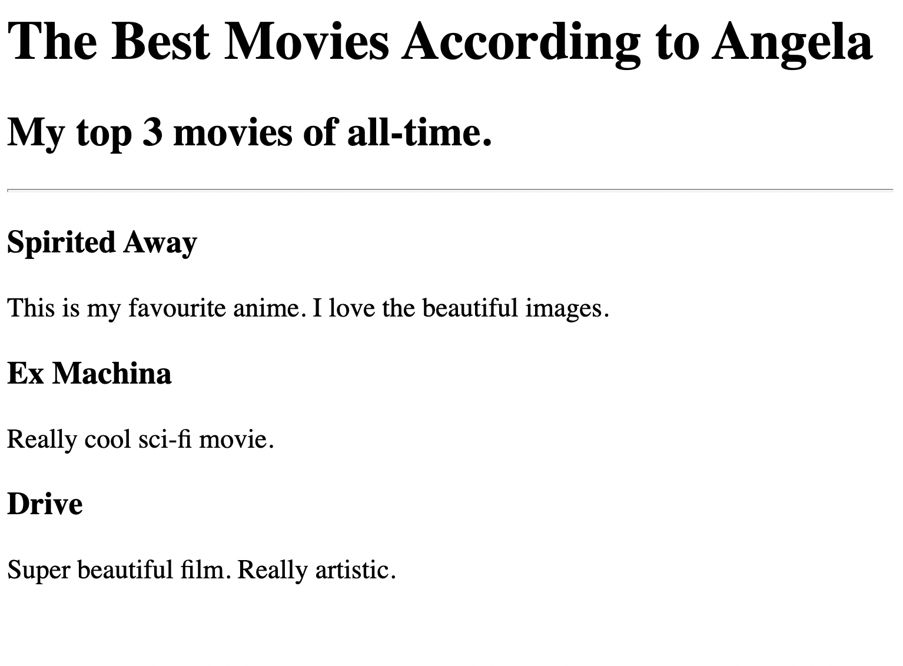
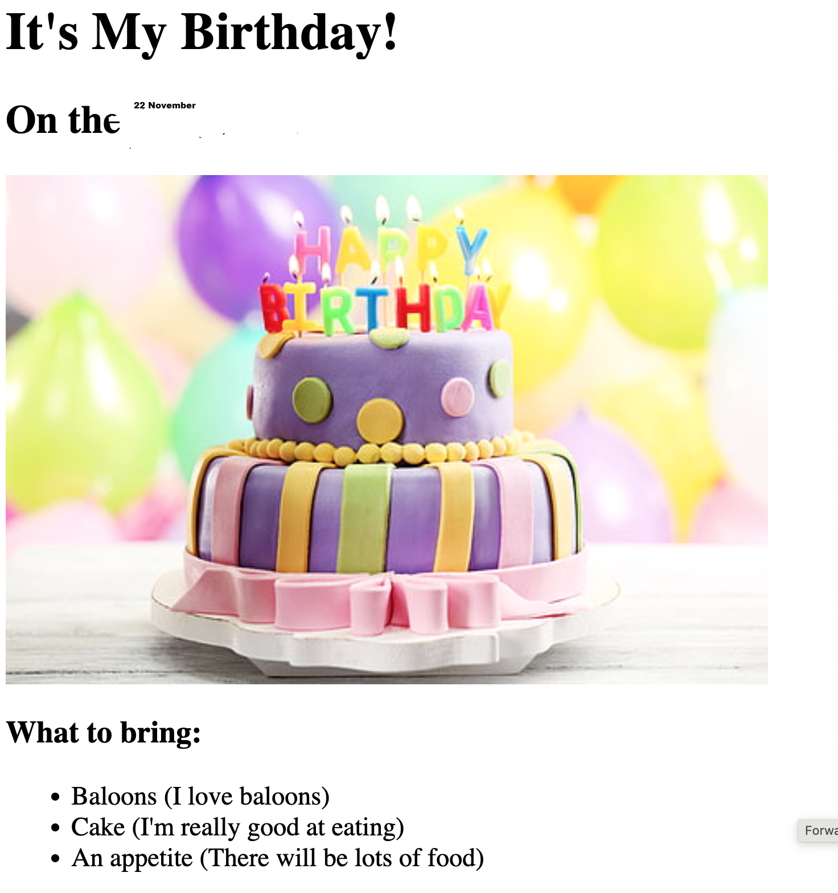

[index.html](https://github.com/user-attachments/files/29085506/index.html)

<html lang="en">

<head>
  <meta charset="UTF-8">
  <title>Angela's Portfolio</title>
</head>

<body>
  <h1>Angela Yu's Portfolio</h1>
  <h2>I'm a Web Developer</h2>
  

  <h3><a href="./public/movie-ranking.html">Movie Ranking Project</a></h3>
  
  <h3><a href="./public/birthday-invite.html">Birthday Invite Project</a></h3>
  
  

  <a href="./public/about.html">About Me</a>
  <a href="./public/contact.html">Contact Me</a>
</body>

</html>b.com/user-attachments/assets/7d6d69ed-769a-4209-b366-9cfc6e6bd6ef" />

